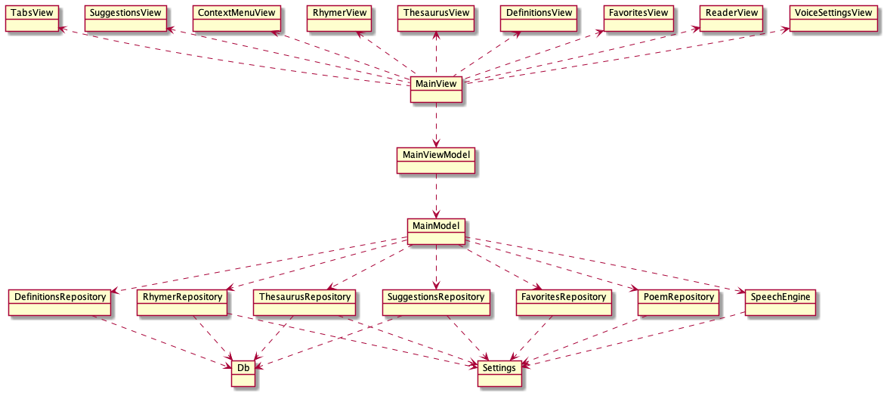

Poet Assistant Web Architecture
===============================

This project is essentially a "vanilla javascript" project. The libraries included are:
* material design
* sql.js

When starting this project, I didn't know any javascript frameworks (I still don't...).  I was a bit intimidated by the task of having to choose a framework, and then by the learning curve of the selected framework.  I thought I would give a try at starting a project without a framework, and then consider using one if it really got to be too challenging without.

Things I've had to do myself which would probably be provided by a framework:
* Generate HTML snippets for various UI components, using a material theme (buttons, context menus, lists...)
* Managing strings in a json file, instead of embedding them directly in the code/html snippets.

However, it hasn't been too much work to manage these myself.

The architecture of this project is based on MVVM (as a mostly Android developer, that's what I'm most comfortable with):


However, the project currently doesn't use a databinding framework. For now, communication between the view and viewmodel is done in code:
* For downward communication, the `MainView` calls the `MainViewModel` when a view is clicked
* For upward communication, the `MainView` subscribes to the `ObservableField`s exposed by `MainViewModel`

For example:
```javascript
// Downward
this._viewVoiceSettings.pitchObserver = (pitchValue) => { this._viewModel.setVoicePitch(pitchValue) }
// Upward
this._viewModel.searchTextDisabled.observer = (isDisabled) => this._mdcInputTextSearch.disabled = isDisabled
```

